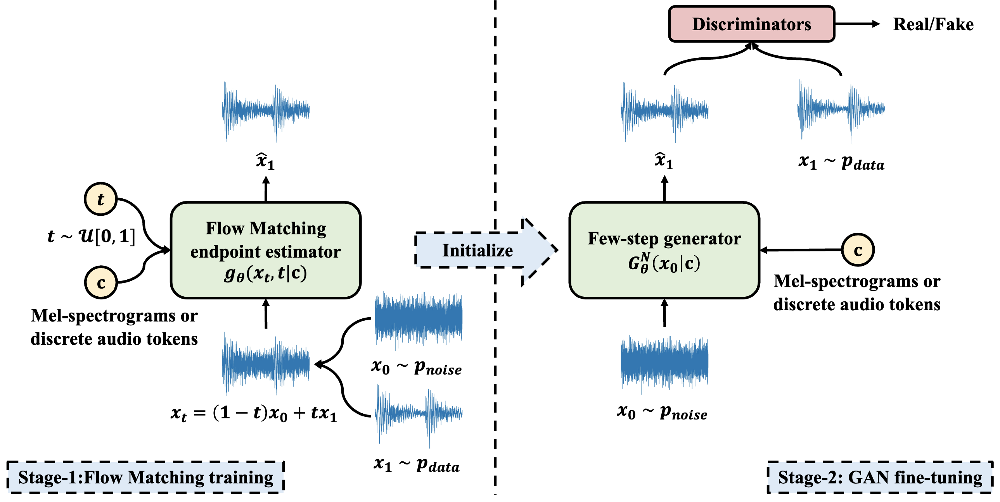
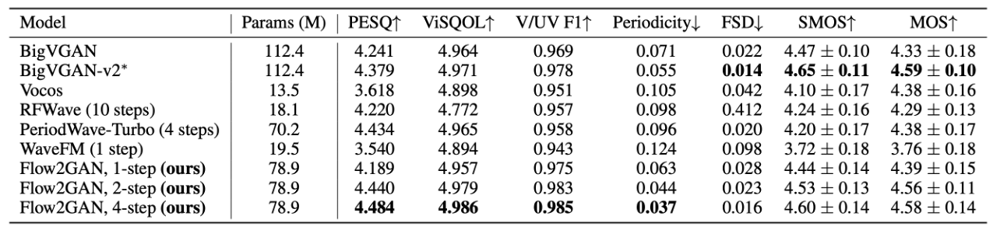
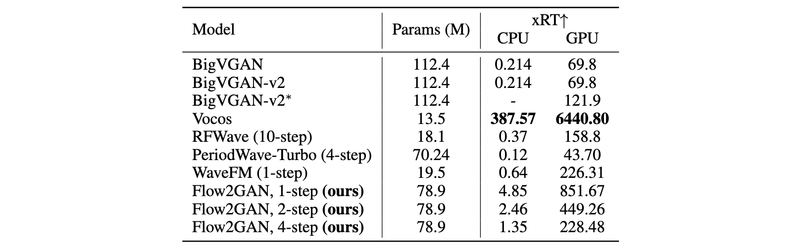

# Flow2GAN [](https://arxiv.org/abs/2512.23278) [](https://flow2gan.github.io) [](https://huggingface.co/k2-fsa/Flow2GAN)

This repo is the official implementation of ["Flow2GAN: Hybrid Flow Matching and GAN with Multi-Resolution Network for Few-step High-Fidelity Audio Generation"](https://arxiv.org/abs/2512.23278). Flow2GAN enables high-fidelity audio generation from Mel-spectrograms or discrete audio tokens with efficient few-step (even one-step) inference.

## Overreview

<!-- **Flow2GAN** delivers **high-fidelity audio generation** from Mel-spectrograms or discrete audio tokens, achieving **better quality–efficiency trade-offs** than existing state-of-the-art GAN-based and Flow Matching-based methods. It is a two-stage framework that **combines Flow Matching training** for learning generative capabilities **with GAN fine-tuning** for efficient few-step (even one-step) inference. To better model audio, we introduce two Flow Matching improvements: 1) **reformulating the objective as endpoint estimation,** avoiding velocity estimation difficulties when involving empty regions; 2) **applying spectral energy-based loss scaling** to emphasize perceptually salient quieter regions. In addition, Flow2GAN adopts a multi-branch architecture that processes Fourier features at multiple time–frequency resolutions, improving modeling capacity over prior single-resolution design. -->

Existing dominant methods for audio generation include Generative Adversarial Networks (GANs) and diffusion-based methods like Flow Matching. GANs suffer from slow convergence and potential mode collapse during training, while diffusion methods require multi-step inference that introduces considerable computational overhead. In this work, we introduce **Flow2GAN**, a two-stage framework that **combines Flow Matching training** for learning generative capabilities **with GAN fine-tuning** for efficient **few-step inference**. Specifically, given audio's unique properties, we first **improve Flow Matching for audio modeling** through: 1) **reformulating the objective as endpoint estimation**, avoiding velocity estimation difficulties when involving empty regions; 2) **applying spectral energy-based loss scaling** to emphasize perceptually salient quieter regions. 
Building on these Flow Matching adaptations, we demonstrate that a further stage of lightweight GAN fine-tuning enables us to obtain one-step generator that produces high-quality audio. In addition, we develop a **multi-branch network architecture** that processes Fourier coefficients at different time-frequency resolutions, which improves the modeling capabilities compared to prior single-resolution designs. 
Experimental results indicate that our **Flow2GAN delivers high-fidelity audio generation** from Mel-spectrograms or discrete audio tokens, achieving **better quality-efficiency trade-offs** than existing state-of-the-art GAN-based and Flow Matching-based methods.

### Overall framework



### Mel-conditioned results comparison on LibriTTS test-set



### Speed comparison (batch size = 16, length = 1s)



### Mel-conditioned results comparison on [24kHz universal audio test-set](https://drive.google.com/file/d/1WjRRfD1yJSjEA3xfC8-635ugpLvnRK0f/view) from [RFWave repo](https://github.com/bfs18/rfwave) 

| Model | PESQ ↑ | ViSQOL ↑ |
|-------|--------|----------|
| [BigVGAN-v2](https://huggingface.co/nvidia/bigvgan_v2_24khz_100band_256x) | 3.945 | 4.935 |
| Flow2GAN, 1-step | 3.925 | 4.918 |
| Flow2GAN, 2-step | 4.121 | 4.949 |
| Flow2GAN, 4-step | **4.203** | **4.958** |

## News

**2025/12/30**: **Flow2GAN with Mel-spectrogram conditioning** is released, with checkpoints available at
[](https://huggingface.co/k2-fsa/Flow2GAN)

**2025/12/31**: Chinese WeChat blog post about Flow2GAN: [BigVGAN 平替：高保真声码器 Flow2GAN
](https://mp.weixin.qq.com/s/-AxK52LHASXSq1ihMHSa0Q)

**2026/01/20**: **Mel-spectrogram conditioned model checkpoints trained on a large-scale universal audio dataset (24kHz, 44kHz)** are now available at [](https://huggingface.co/k2-fsa/Flow2GAN)

## Installation

### 1. Clone the repository

```bash
git clone https://github.com/k2-fsa/Flow2GAN.git

cd Flow2GAN
```

### 2. Install the required packages

```bash
pip install -r requirements.txt
```

### 3. (Optional) Install the required packages for computing objective metrics

```bash
pip install -r requirements_eval.txt

# For ViSQOL, please follow instructions at https://github.com/google/visqol
```

### 4. Set PYTHONPATH
```bash
export PYTHONPATH=$PWD:$PYTHONPATH
```

## Usage

The following examples will automatically download the required pretrained models from HuggingFace Hub. 
If you have trobles accessing HuggingFace, you can consider setting up the HF mirror endpoint:

```bash
export HF_ENDPOINT=https://hf-mirror.com
```

### Inference from wav file (reconstruction)

```python
import os
import soundfile as sf
import torch
import torchaudio
from flow2gan import get_model
from flow2gan.models.modules import LogMelSpectrogram

step = 4  # Could set step to 1,2,4
# 24kHz model
model_name = "mel_24k_base"
hf_model_name = f"libritts-mel-{step}-step"
# hf_model_name = f"universal-24k-mel-{step}-step"  # For universal audio model

# 44kHz model
# model_name = "mel_44k_128band_512x_base"
# hf_model_name = f"universal-44k-mel-128band-512x-{step}-step"  # For universal audio model

# Required model will be downloaded from HuggingFace Hub automatically
model, model_cfg = get_model(model_name=model_name, hf_model_name=hf_model_name)

cond_module = LogMelSpectrogram(
    sampling_rate=model_cfg.sampling_rate,
    n_fft=model_cfg.mel_n_fft,
    hop_length=model_cfg.mel_hop_length,
    n_mels=model_cfg.n_mels,
    center=True,
    power=1,
)

device = torch.device("cpu")
if torch.cuda.is_available():
    device = torch.device("cuda", 0)

model.to(device)
model.eval()
cond_module.to(device)
cond_module.eval()

input_path = "./test_data/wav/1089_134686_000002_000000.wav"
# input_path = "./test_data/wav_44k/mixture.wav"
output_path = "output.wav"
audio, sr = torchaudio.load(input_path)  
assert sr == model_cfg.sampling_rate
audio = audio.to(device)  
if audio.shape[0] > 1:
    audio = torch.mean(audio, dim=0, keepdim=True)  # to mono
# audio: (1, samples)

with torch.inference_mode():
    mel_spec = cond_module(audio)  # (1, n_mels, frames)
    pred_audio = model.infer(cond=mel_spec, n_timesteps=step, clamp_pred=True)

sf.write(output_path, pred_audio.cpu().squeeze(0).numpy(), sr)
print(f"Wrote output to {output_path}")
```

### Inference from Mel-spectrograms

```python
import os
import soundfile as sf
import torch
from flow2gan import get_model

step = 4  # Could set step to 1,2,4

# 24kHz model
model_name = "mel_24k_base"
hf_model_name = f"libritts-mel-{step}-step"
# hf_model_name = f"universal-24k-mel-{step}-step"  # For universal audio model

# 44kHz model
# model_name = "mel_44k_128band_512x_base"
# hf_model_name = f"universal-44k-mel-128band-512x-{step}-step"  # For universal audio model

# Required model will be downloaded from HuggingFace Hub automatically
model, model_cfg = get_model(model_name=model_name, hf_model_name=hf_model_name)

device = torch.device("cpu")
if torch.cuda.is_available():
    device = torch.device("cuda", 0)

model.to(device)
model.eval()

input_path = "./test_data/mel/1089_134686_000002_000000.pt"
# input_path = "./test_data/mel_44k_128band_512x/mixture.pt"
output_path = "output.wav"
mel_spec = torch.load(input_path)  # (1, n_mels, frames)
mel_spec = mel_spec.to(device)  

with torch.inference_mode():
    pred_audio = model.infer(cond=mel_spec, n_timesteps=step, clamp_pred=True)

sf.write(output_path, pred_audio.cpu().squeeze(0).numpy(), model_cfg.sampling_rate)
print(f"Wrote output to {output_path}")
```

### Inference from directory of Mel-spectrograms or audio files

```bash
step=4  # Could be 1,2,4

# 24kHz model
model_name=mel_24k_base
hf_model_name=libritts-mel-${step}-step
# hf_model_name=universal-24k-mel-${step}-step  # For universal audio model

# 44kHz model
# model_name=mel_44k_128band_512x_base
# hf_model_name=universal-44k-mel-128band-512x-${step}-step  # For universal audio model

# Required model will be downloaded from HuggingFace Hub automatically

# Infer from a directory of mel files (*.pt)
python -m flow2gan.bin.infer_dir \
    --model-name $model_name \
    --n-timesteps $step \
    --hf-model-name $hf_model_name \
    --input-type mel \
    --input-dir ./test_data/mel/ \
    --output-dir ./output_from_mel/

# Infer from a directory of audio files (*.wav)
python -m flow2gan.bin.infer_dir \
    --model-name $model_name \
    --n-timesteps $step \
    --hf-model-name $hf_model_name \
    --input-type audio \
    --input-dir ./test_data/wav/ \
    --output-dir ./output_from_wav/
```

### Run the full LibriTTS pipeline to reproduce the reported results, including data preparation, training, inference, and metric evaluation (see details in `run_libritts.sh`). 
```bash
bash run_libritts.sh
# You can also extend it to your own dataset with necessary modifications.
```

## Discussion & Communication

You can directly discuss on [Github Issues](https://github.com/k2-fsa/Flow2GAN/issues).

You can also scan the QR code to join our wechat group or follow our wechat official account.

| Wechat Group | Wechat Official Account |
| ------------ | ----------------------- |
| | |


## Citation

```bibtex
@article{yao2025flow2gan,
  title={Flow2GAN: Hybrid Flow Matching and GAN with Multi-Resolution Network for Few-step High-Fidelity Audio Generation},
  author={Zengwei Yao, Wei Kang, Han Zhu, Liyong Guo, Lingxuan Ye, Fangjun Kuang, Weiji Zhuang, Zhaoqing Li, Zhifeng Han, Long Lin, Daniel Povey},
  journal={arXiv preprint arXiv:2512.23278},
  year={2025}
}
```